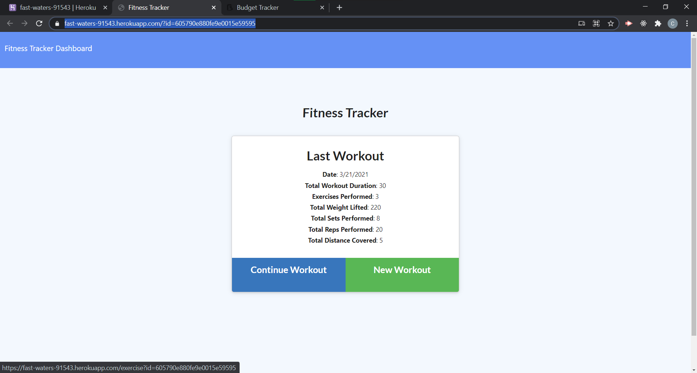
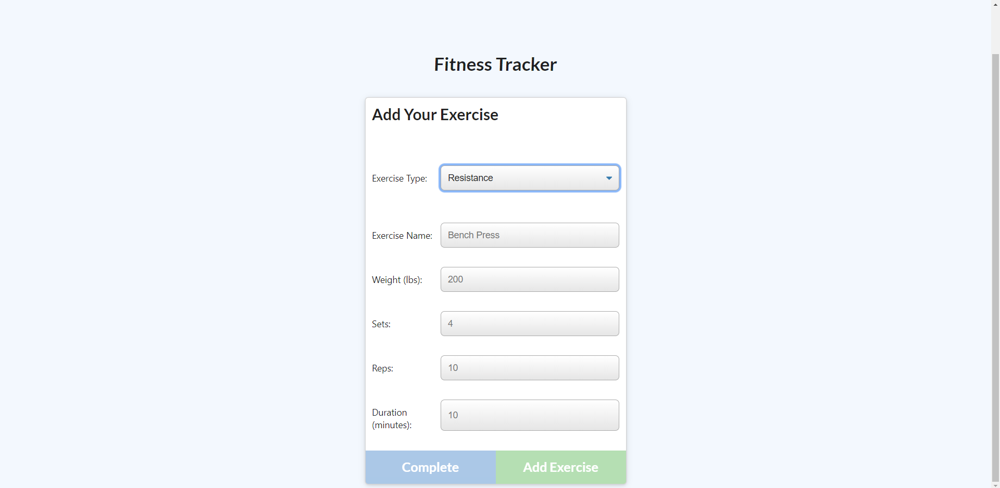

 
  # Workitout
   A fitness tracker that calculates my workouts throughtout the day. displaying the total amounts of duration,exercises perforemed, weights lifted, total sets performed, and distnce. it will even display a graph

  ## Table of Contents
  [Installation](#installation)  
  [Usage](#usage)  
  [Contributions](#contribution)  
  [Tests](#test)  
  [License](#license)  
  [Questions](#questions)  
  

    
  ## <h2 id="installation">Installation Instructions</h2>

    npm i express mongoose morgan

  ## <h2 id="usage">Usage</h2>
  working out has a lot of variables and we are always aiming for the end result. this data will help us know better when we reached our desired goal.
  ## <h2 id="contribution">Contributions</h2>
  Any contributions are welcomed. 
  ## <h2 id="test">Test Instructions</h2>
  none
  ## <h2 id="license"> License</h2>
   
  ## <h2 id="questions"> Questions </h2>
    Any questions please contact me at
   [Github](https://github.com/Tevvels)
   or at email:chrisbwatkins@gmail.com

   ## <h2> Live Site! </h2>
    https://fast-waters-91543.herokuapp.com/?id=605790e880fe9e0015e59595

